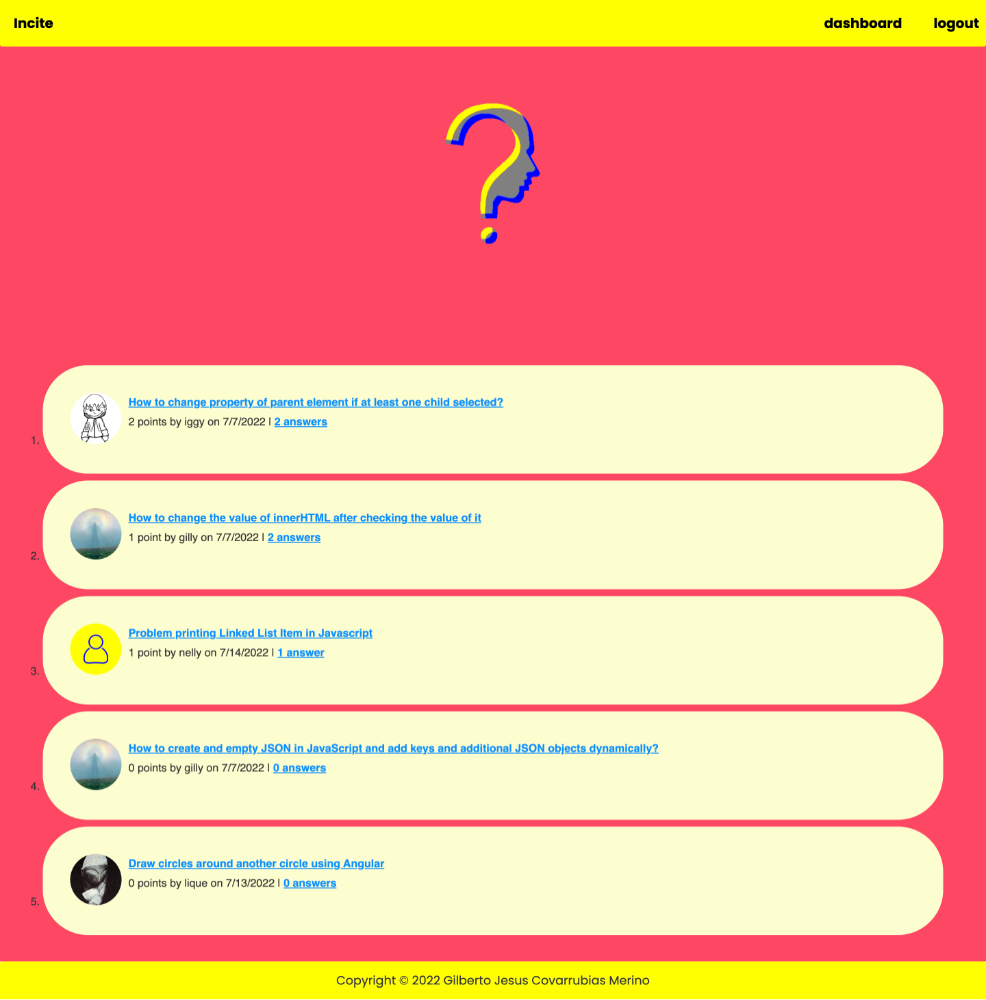

# Incite

## Description
---
Incite was created as an online community for programmers. The websites goal is to allows users to tap into the collective wisdom of the Incite user community. Incite is a question and answer website. Users can post their coding questions to the community. Other users can then comment their answers to these questions. Both questions and answers are subject to a voting system. The voting systems determines the order in which the questions and answers are then presented on the page, with those receiving the most votes presented first. 

## Table of Contents
- [Link to website](#link-to-website)
- [Usage](#usage)
- [Features](#features)
- [License](#license)

## Link to Website
---
[Website](https://stormy-dawn-68480.herokuapp.com/)

## Usage
---
Use your browser to visit the website. Once on the homepage you will see questions posted by other users. Click on "login/sign-up" in the navigation bar. Then select "Sign-up instead." Once on the sign-up page enter your credentials and create an account. Once the account is created you are taken to the user dashboard. Here, you can create your questions, are given access to all your previously posted questions and are given the ability to edit your previous questions. Once you create your first question you are also given the ability to upload a personal user avatar. If you go back to the homepage you can now post answers to other user's questions. Click on the question title. Once on the question page, scroll down to the answer form. Once you submit your answer it will be populated on the page. Now that you have an account you can aslo vote on both answers and questions. To vote on a question you must be on the individual question page. Once there, click the "upvote" button. To vote on an answer you must also be on the inidividual question page. Once you find a question you like, click on the "helpful" button. 

## Features
---
User accounts, personal user avatar, question posting, question editing, answer posting, and voting on posts and answers

## License
---
MIT License

Copyright (c) 2021 Gilberto Jesus Covarrubias Merino

Permission is hereby granted, free of charge, to any person obtaining a copy
of this software and associated documentation files (the "Software"), to deal
in the Software without restriction, including without limitation the rights
to use, copy, modify, merge, publish, distribute, sublicense, and/or sell
copies of the Software, and to permit persons to whom the Software is
furnished to do so, subject to the following conditions:

The above copyright notice and this permission notice shall be included in all
copies or substantial portions of the Software.

THE SOFTWARE IS PROVIDED "AS IS", WITHOUT WARRANTY OF ANY KIND, EXPRESS OR
IMPLIED, INCLUDING BUT NOT LIMITED TO THE WARRANTIES OF MERCHANTABILITY,
FITNESS FOR A PARTICULAR PURPOSE AND NONINFRINGEMENT. IN NO EVENT SHALL THE
AUTHORS OR COPYRIGHT HOLDERS BE LIABLE FOR ANY CLAIM, DAMAGES OR OTHER
LIABILITY, WHETHER IN AN ACTION OF CONTRACT, TORT OR OTHERWISE, ARISING FROM,
OUT OF OR IN CONNECTION WITH THE SOFTWARE OR THE USE OR OTHER DEALINGS IN THE
SOFTWARE.